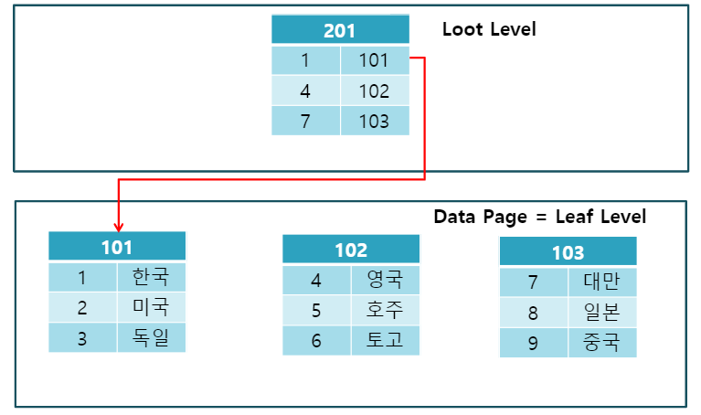
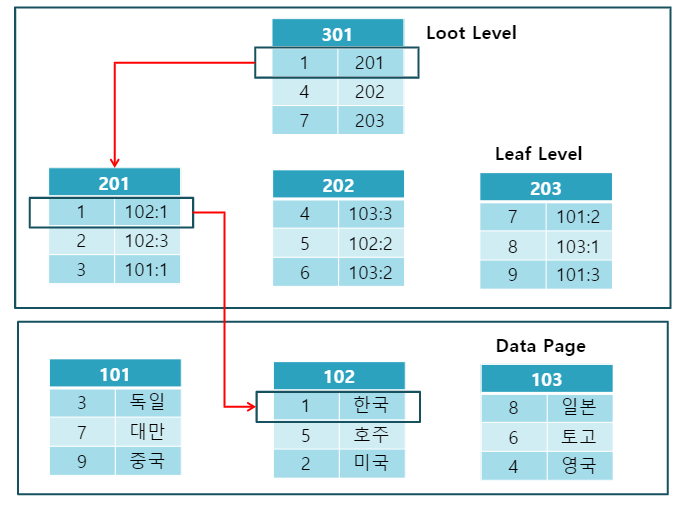
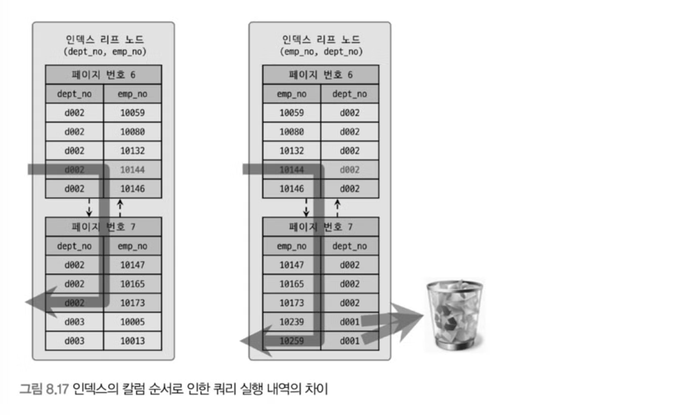

# 인덱스를 사용하는 이유와 장점

인덱스란?

- 데이터베이스에서 데이터를 조회할 때 빠른 조회를 위한 것이다. 

왜 인덱스를 사용하면 조회가 빨라질까?

- 인덱스는 트리 구조로 데이터를 저장한다. 테이블을 풀 스캔하는 경우 (테이블 스캔) 와 달리 인덱스를 사용하면 정렬된 데이터를 기준으로 루트 노드에서 리프 노드까지 빠르게 데이터를 탐색 (인덱스 스캔) 할 수 있다.
- 기존 테이블 풀 스캔이 O(N)의 시간 복잡도라면 트리 구조를 사용한 이진 탐색은 O(logN)의 시간복잡도를 가진다.

정확히 어떤 자료구조를 사용하는가? 

- InnoDB를 기준으로 균형 잡힌 트리 (B-Tree, Balanced Tree)를 사용한다.
- 단순 이진 트리를 사용할 경우 한 쪽에 치우친 트리가 생길 수 있어, 최악의 경우 선형 탐색과 다르지 않을 수 있다. 따라서 모든 노드에 대해 높이 차이가 일정한 B-Tree를 사용한다.

MyISAM과 InnoDB가 데이터 파일에 접근하는 과정의 차이점이 있는가? 

- MyISAM 테이블은 세컨더리 인덱스가 물리적인 주소를 참조하고, InnoDB는 PK를 사용하기 때문에 논리적인 주소를 참조한다. 
- 세컨데리 인덱스는 PK가 아닌 다른 컬럼에 대한 인덱스이다. B-Tree 구조로 저장된다. 
- MyISAM의 경우 세컨데리 인덱스는 Non-Clustered Index로 취급되는 반면 InnoDB의 경우 Clustered Index로 취급된다.
- 그래서 조회 자체는 InnoDB가 느릴 지 몰라도, 클러스터링 인덱스가 클러스터링 인덱스를 사용하기 때문에 충분히 좋은 성능을 낸다.

왜 InnoDB는 레코드의 주소를 참조하지 않고 PK를 참조할까? 

- 클러스터링 키가 변경될 때마다 주소가 바뀐다. 그렇다면 세컨데리 인덱스가 매핑된 주소를 모두 변경해야하는 불편함이 생긴다. 
- MyISAM의 경우 데이터가 한번 저장되면 그 공간을 영원히 사용하기 때문에 변경할 일이 없다. 
- 위에서 말한 클러스터링 인덱스에 대해서 자세히 설명하자면, 클러스터링 인덱스는 PK를 기준으로 정렬되어있기 때문에 쉽게 레코드를 찾을 수 있다.

Clustered 구조와 Non-Clustered의 구조



- 데이터베이스의 실제 테이블을 인덱스로 정렬한다.
- 테이블 당 단 하나의 Clustered Index만 존재한다.  



- 실제 테이블의 행과 독립적이다. 정렬되어있지 않다. 
- Leaf Level의 테이블의 각 레코드와 데이터 파일의 각 레코드가 매핑되어있다. 이 방식은 PK일 수도, 물리적 주소일 수도 있다. 

Cardinality 에 대해 설명

- 기수성. 하나의 컬럼에 대한 레코드를 모두 보았을 때, 중복도가 높을수록 Cardinality는 낮다. 즉 해당 컬럼에 인덱스를 적용했을 때 효과가 적다. 
- 인덱스를 걸 때는 해당 컬럼이 가지고 있을 레코드의 기수성이 높다는  것을 확인해야한다. 기수성이 낮은 상황을 가정해보자. 인덱스를 걸지 않았을 때보다 걸었을 때 조회해야 하는 레코드 수가 20% 이상이라면 인덱스를 걸지 않는게 낫다. 인덱스를 걸었을 때 레코드 1건을 읽을 때 비용이 걸지 않았을 때보다 4~5배 더 높기 때문이다.

인덱스를 걸게 되면 레코드 한 건당 조회 비용이 왜 늘어나는가? 

- 트리 노드부터 리프 노드까지 탐색하는 과정에서 여러 노드를 거쳐가기 때문에 탐색 비용이 든다. 탐색을 위해 조회하는 레코드 수는 줄어들지만 페이지 간 이동 시 디스크 I/O가 발생하기 때문이다. 
- 따라서 약 4 ~ 5배의 비용이 들게 되고 조회할 레코드 수가 전체 레코드 수의 20% 가 넘어가면 인덱스가 효과적이지 않을 수 있다.

데이터를 추가했을 때 시간 복잡도가 무엇인가? 왜?

- 인덱스를 적용하게 되면 삽입 시간 복잡도가 이전보다 logN배 증가한다. 
- 트리 구조에서 삽입할 데이터 위치를 찾기 위해 O(logN)의 시간 복잡도가 들기 때문이다. 

동등 비교와 범위 조건에 대한 다중 컬럼 인덱스를 걸 때, 무엇을 먼저 거는 것이 효율적인가? 

```sql
SELECT * 
FROM dept_emp 
WHERE dept_no='d002' AND emp_no >= 10114;
```


- 케이스 A에서는 작업 범위 결정 조건인 dept_no='d002'를 먼저 적용하고, 그 범위 내에서 emp_no >= 10114를 효율적으로 처리할 수 있다.
- 케이스 B에서는 emp_no >= 10114가 작업 범위 결정 조건이므로, 이후 필터링 조건인 dept_no='d002'를 하나하나 비교해야 하며, 인덱스를 완전히 활용하지 못해 비효율적이다.
 - 다중 칼럼 인덱스에서 첫 번째 칼럼에 의해 정렬된 후 그 범위 내에서만 다음 칼럼이 정렬되기 때문에, 첫 번째 칼럼 선택이 인덱스 활용에 중요한 역할을 한다.