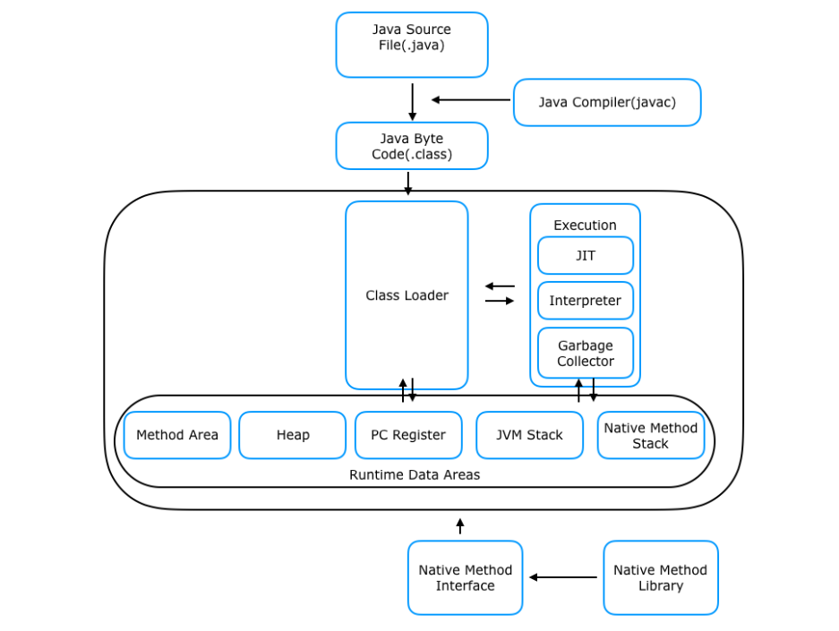

# Java의 실행 방식

## Java의 실행 방식
* JDK 내에 있는 Java 컴파일러 (javac) 가 Java 코드 (.java) 를 Java 바이트 코드 (.class) 로 변환한다. 
* JVM의 ClassLoader가 클래스 파일을 메모리에 로드한 후 바이트 코드를 실행한다.
* JVM의 인터프리터가 바이트 코드를 해석한다. 
* JIT (Just In Time) Compiler가 기계어로 변환한다. 

> 바이트 코드로 변환하는 이유는 ?
>
> JVM에서 바이트 코드를 실행 가능하기 때문이다.
> JVM이 OS에 독립적으로 컴파일을 수행한다.

## JDK의 구조 
* javac (Java Compiler)
* JRE
  * JVM
  * 표준 라이브러리
* 그 외 개발 도구 (JAR, Javadoc, ...)

# JVM의 구조

- Class Loader
  - 자바 클래스 파일을 JVM에 로드하는 역할
- Execution Engine
  - 바이트 코드를 실제 실행하여 기계어로 변환
  - 인터프리터, JIT 컴파일러, Heap 영역을 GC
- Memory Area 
  - Method Area 에는 클래스 정보와 정적 변수
  - Heap Area 에는 동적 객체와 배열.
  - Stack Area 에는 스레드가 있음. 스택에는 Stack Frame을 사용해서 지역 변수와 매개변수를 관리.
  - PC Register 는 바이트 코드 명령어의 주소를 저장
  - Native Method Stack 은 C/C++의 네이티브 코드로 작성된 메서드 관리. 

하나의 스레드는 Method와 Heap Area를 공유한다. Stack Area는 스레드 별로 독립적이다.

> 일반적으로 사용자의 요청이 여러 개 들어왔을 때 생성되는 스레드도 Java 의 Heap과 Method Area를 공유하는가? 
> 
> 그렇다. 그래서 동기화 문제가 생기는 것이고, 스레드가 독립적으로 작업하는 데이터 (지역 변수)는 스레드의 별도의 스택에 저장된다. 