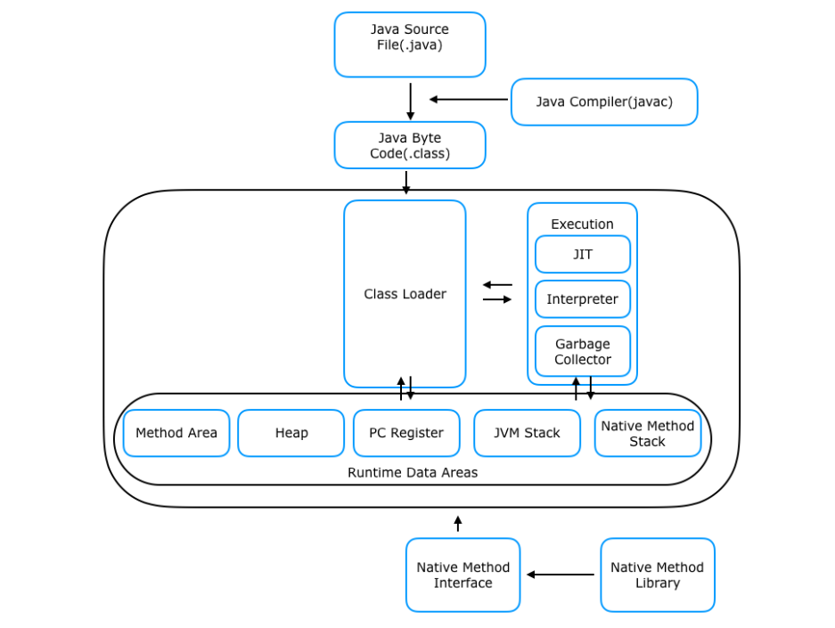

# Java의 실행 방식
* JDK 내에 있는 Java 컴파일러가 Java 코드를 Java 바이트 코드로 변환한다. 
* JDK를 설치하면 JRE가 포함되어있다. JRE 내에 있는 JVM이 이 바이트 코드를 각 OS 가 이해할 수 있는 언어로 번역한다.
* JDK 내에 있는 JAR이 실행 가능한 파일로 압축한다.

# JVM의 구조

- Method Area와 Heap Area는 스레드 간 공유가 가능하다.